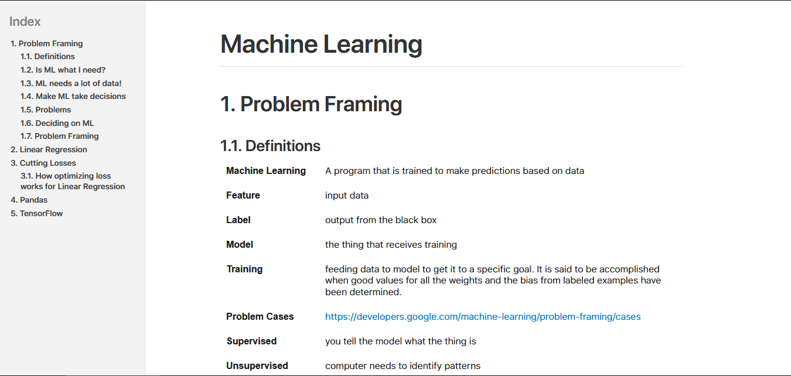
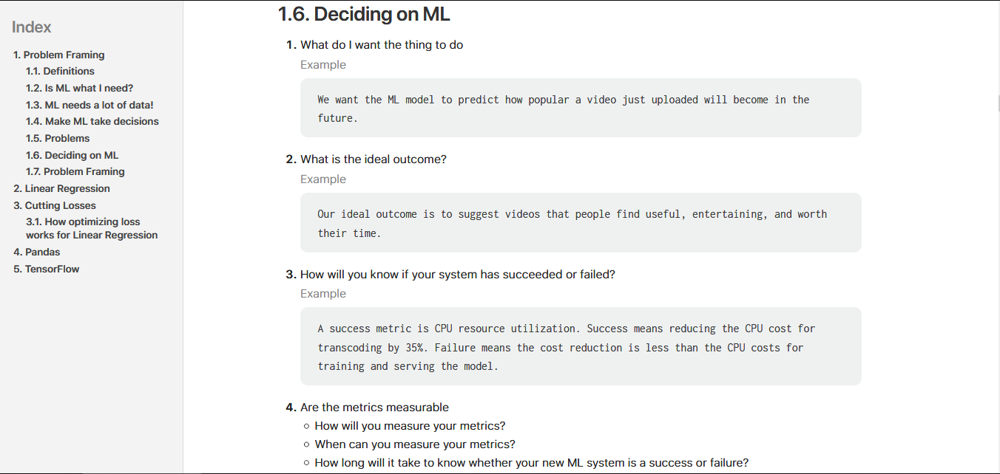
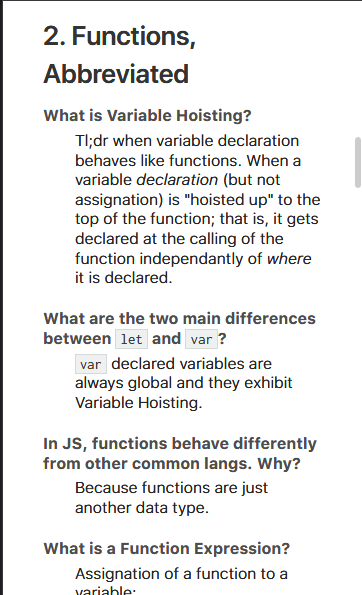

= CleanDoctor Stylesheet Factory
:toc:

This is a fork of the original Asciidoctor Stylesheet Factory,
modified to create a clean, HIG compliant design.

== Foundation

The stylesheets in this project are built using http://compass-style.org[Compass], a CSS authoring framework that uses http://sass-lang.com[Sass] to generate CSS files.
The styles and components are generated by http://foundation.zurb.com[Foundation 4], an awesome and flexible CSS component framework that ensures your stylesheet is cross-browser friendly and mobile friendly.

== Setup and compilation

To setup the project, make sure you have Ruby, RubyGems and, optionally, Bundler.
Next, run Bundler to install the required gems:

 $ bundle install

That command is equivalent to executing:

 $ gem install --version '0.12.7' compass
 $ gem install --version '4.3.2' zurb-foundation

Once you have the gems installed, you can build the stylesheets.

== Build the stylesheet

To build the stylesheets, simply run:

 $ compass compile

The stylesheets are compiled from the Sass source files in the +sass/+ folder and written to the +stylesheets/+ folder.
You can then reference the stylesheets in +stylesheets/+ from your HTML file.

== Use sample document for reference

You can use the sample document inside  +stylesheet/+ to live preview
the output.

 $ asciidoctor -a stylesheet=./stylesheets/rocket-panda.css sample.adoc

If you want to activate syntax highlighting in the code, add this argument:

 -a source-highlighter=highlightjs 

Now just browse to +index.html+ in your browser and checkout the result!

== External preview

You may want to preview sample HTML files on another computer or device.
To do that, you need to serve them through a web server.
You can quickly serve HTML files in the root directory of the project using the following command:

 python -m SimpleHTTPServer 4242

NOTE: You don't have to include the underscore prefix when importing files.

NOTE: The +awesome-icons+ component is only applicable to HTML generated by Asciidoctor >= 0.1.2 with the +icons+ attribute set to +awesome+.

You can add any explicit customizations below the import lines.

The variables you can set in +sass/settings/_hipster.scss+ are a combination of the {source}/blob/master/sass/settings/_settings.scss.dist[Foundation 4 built-in global settings] and {source}/blob/master/sass/settings/_defaults.scss[global settings and imports for the AsciiDoc components].

I hope you can enjoy this theme as much as I did creating it!
